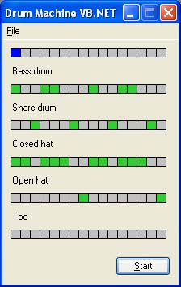

# RhythmMachine

I'm migrating this project from it's original location at [Coding 4 Fun Drum Machine (in VB.NET)](http://addressof.com/posts/coding-4-fun-drum-machine-in-vb-net/) to here as I've got some interest in revisiting it.

Below is a reproduction of the original article from [2004](https://web.archive.org/web/20040204040025/http://msdn.microsoft.com/vbasic/using/columns/code4fun/default.aspx?pull=/library/en-us/dncodefun/html/code4fun02032004.asp); reformatted to markdown.

Note: I plan to update the article (information below) to match this specific project; but the original is here as a starting point.

---

## Coding 4 Fun - Building a Drum Machine with Direct Sound
Ianier Munoz (Chronotron)
February 2, 2004

**Summary**: Guest columnist Ianier Munoz builds a drum machine using the managed Microsoft DirectX libraries and C# to synthesize an audio stream on the fly.

## Busting Out the Beats
(An introduction from Duncan Mackenzie.)

Ianier has a cool job; he writes code for DJs, allowing them to do professional digital signal processing (DSP) work using consumer software like Microsoft® Windows Media® Player. Very neat work, and lucky for us, he is digging into the world of managed code and managed Microsoft® DirectX®. In this article, Ianier has built a demo (see Figure 1) that will have you pounding your very own bass beats out of your little computer speakers in minutes. It's a managed drum machine that lets you configure and play multiple channels of sampled music. The code should work without any real configuration, but you have to make sure to download and install (and then restart) the DirectX SDK (available from here) before you open and run the winrythm sample project.



Figure 1. The main form of the drum machine
(Oh yeah, oh yeah... boom, boom, boom...)

## Introduction
Prior to the release of the DirectX 9 SDK, the Microsoft® .NET Framework was desperately soundless. The only way you could work around this limitation was by accessing the Microsoft® Windows® API through COM Interop or P-Invoke.

Managed Microsoft® DirectSound®, which is a component of DirectX 9, allows you to play sounds in .NET without resorting to COM Interop or P-Invoke. In this article I will explain how to implement a simple drum machine (see Figure 1) by synthesizing audio samples on the fly, using DirectSound to play the resulting stream.

This article assumes that you're familiar with C# and the .NET Framework. Some basic knowledge of audio processing would also help you better understand the ideas described here.

The code accompanying this article was compiled with Microsoft® Visual Studio® .NET 2003. It requires the DirectX 9 SDK, which you can download from here.

## A Quick Overview of DirectSound
DirectSound is a component of DirectX that gives applications access to audio resources in a hardware-independent way. In DirectSound, the unit of audio playback is the sound buffer. A sound buffer belongs to an audio device, which represents a sound card in the host system. When an application wants to play a sound using DirectSound, it creates an audio device object, creates a buffer on the device, fills the buffer with sound data and then plays the buffer. For a detailed explanation of the relationship between the different DirectSound objects, check the DirectX SDK documentation.

Sound buffers can be classified as static buffers or as streaming buffers depending on their intended usage. Static buffers are initialized once with some predefined audio data and then played as many times as necessary. This kind of buffer is typically used in games for shots and for other short effects. Streaming buffers, on the other hand, are typically used for playing content that is too big to fit in memory, or those sounds whose length or content cannot be determined in advance, such as the speaker's voice in a telephony application. Streaming buffers are implemented using a small buffer that is constantly refreshed with new data as the buffer is playing. While managed DirectSound provides good documentation and examples for static buffers, it currently lacks an example on streaming buffers.

It should be mentioned, though, that Managed DirectX does include a class for playing audio streams, namely the `Audio` class in the `AudioVideoPlayback` namespace. This class allows you to play most kinds of audio files, including WAV and MP3. However, the `Audio` class doesn't allow you to select the output device programmatically, and it doesn't give you access to the audio samples, in case you want to modify them.

## The Streaming Audio Player
I defined a streaming audio player as a component that pulls audio data from some source and plays it back through some device. A typical streaming audio player component would play the incoming stream through the sound card, but it could also send the audio stream over the network or save it to a file.

The `IAudioPlayer` interface contains everything that our application should know about the player. This interface will also allow you to isolate your sound synthesis engine from the actual player implementation, which may be useful if you want to port this example to another .NET platform that uses a different playback technology.

```cs
/// <summary>
/// Delegate used to fill in a buffer
/// </summary>
public delegate void PullAudioCallback(IntPtr data, int count);

/// <summary>
/// Audio player interface
/// </summary>
public interface IAudioPlayer : IDisposable
{
    int SamplingRate { get; }
    int BitsPerSample { get; }
    int Channels { get; }

    int GetBufferedSize();
    void Play(PullAudioCallback onAudioData);
    void Stop();
}
```

The `SamplingRate`, `BitsPerSample`, and `Channels` properties describe the audio format that the player understands. The `Play` method starts playback of the stream supplied by a `PullAudioCallback` delegate, and the `Stop` method, not surprisingly, stops audio playback.

Note that `PullAudioCallback` expects count bytes of audio data to be copied to the data buffer, which is an `IntPtr`. You may think that I should have used a byte array rather than an `IntPtr`, because dealing with data in the `IntPtr` forces the application to call functions that require permission for unmanaged code execution. However, managed DirectSound requires such permission anyway, so using an `IntPtr` has no major implications and may avoid extra data copying when dealing with different sample formats and with other playback technologies.

`GetBufferedSize` returns how many bytes have already been queued into the player since the last call to the `PullAudioCallback` delegate. We will use this method to calculate the current playback position with respect to the input stream.

## Implementing IAudioPlayer using DirectSound
As I mentioned before, a streaming buffer in DirectSound is nothing but a small buffer that is constantly refreshed with new data as the buffer is playing. The `StreamingPlayer` class uses a streaming buffer to implement the `IAudioPlayer` interface.

Let's have a look at the `StreamingPlayer` constructor:

```cs
public StreamingPlayer(Control owner, 
        Device device, WaveFormat format)
{
    m_Device = device;
    if (m_Device == null)
    {
        m_Device = new Device();
        m_Device.SetCooperativeLevel( 
            owner, CooperativeLevel.Normal);
        m_OwnsDevice = true;
    }

    BufferDescription desc = new BufferDescription(format);
    desc.BufferBytes = format.AverageBytesPerSecond;
    desc.ControlVolume = true;
    desc.GlobalFocus = true;

    m_Buffer = new SecondaryBuffer(desc, m_Device);
    m_BufferBytes = m_Buffer.Caps.BufferBytes;

    m_Timer = new System.Timers.Timer( 
          BytesToMs(m_BufferBytes) / 6);
    m_Timer.Enabled = false;
    m_Timer.Elapsed += new System.Timers.ElapsedEventHandler(Timer_Elapsed);
}
```

The `StreamingPlayer` constructor first ensures that we have a valid DirectSound audio device to work with, and it creates a new device if none is specified. For creating a `Device` object, we must specify a Microsoft® Windows Forms control that DirectSound will use to track the application focus; hence the owner parameter. A DirectSound `SecondaryBuffer` instance is then created and initialized, and a timer is allocated. I will come back shortly to the role of this timer.

The implementation of `IAudioPlayer.Start` and `IAudioPlayer.Stop` are quite trivial. The `Play` method ensures that there's some audio data to play; then it enables the timer and starts playing the buffer. Symmetrically, the `Stop` method disables the timer and stops the buffer.

```cs
public void Play( 
     Chronotron.AudioPlayer.PullAudioCallback pullAudio)
{
    Stop();

    m_PullStream = new PullStream(pullAudio);

    m_Buffer.SetCurrentPosition(0);
    m_NextWrite = 0;
    Feed(m_BufferBytes);
    m_Timer.Enabled = true;
    m_Buffer.Play(0, BufferPlayFlags.Looping);
}

public void Stop()
{
    if (m_Timer != null)
        m_Timer.Enabled = false;
    if (m_Buffer != null)
        m_Buffer.Stop();
}
```

The idea is to keep the buffer continuously fed with sound data coming from the delegate. To achieve this goal, the timer periodically checks how much audio data has already been played, and adds more data to the buffer as necessary.

```cs
private void Timer_Elapsed( 
          object sender, 
          System.Timers.ElapsedEventArgs e)
{
    Feed(GetPlayedSize());
}
```

The `GetPlayedSize` function uses the buffer's `PlayPosition` property to calculate how many bytes the playback cursor has advanced. Note that because the buffer plays in a loop, `GetPlayedSize` has to detect when the playback cursor wraps around, and adjust the result accordingly.

```cs
private int GetPlayedSize()
{
    int pos = m_Buffer.PlayPosition;
    return 
       pos < m_NextWrite ? 
       pos + m_BufferBytes - m_NextWrite 
       : pos - m_NextWrite;
}
```

The routine that fills in the buffer is called `Feed` and it's shown in the code below. This routine calls `SecondaryBuffer.Write`, which pulls the audio data from a stream and writes it to the buffer. In our case, the stream is merely a wrapper around the `PullAudioCallback` delegate that we received in the `Play` method.

```cs
private void Feed(int bytes)
{
    // limit latency to some milliseconds
    int tocopy = Math.Min(bytes, MsToBytes(MaxLatencyMs));

    if (tocopy > 0)
    {
        // restore buffer
        if (m_Buffer.Status.BufferLost)
            m_Buffer.Restore();

        // copy data to the buffer
        m_Buffer.Write(m_NextWrite, m_PullStream, 
                       tocopy, LockFlag.None);

        m_NextWrite += tocopy;
        if (m_NextWrite >= m_BufferBytes)
            m_NextWrite -= m_BufferBytes;
    }
}
```

Note that we force the amount of data to add to the buffer to be under a certain limit in order to reduce playback latency. Latency can be defined as the difference between the time when a change in the incoming audio stream occurs and the time when the change is actually heard. Without such latency control, the average latency would be approximately equal to the total buffer length, which might not be acceptable for a real-time synthesizer.

## The Drum Machine Engine
A drum machine is an example of a real-time synthesizer: a set of sample waveforms representing each of the possible drum sounds (also called "patches" in musical jargon) is mixed into the output stream following some rhythmic patterns to simulate a drummer's play. This is as simple as it sounds, so let's dig into the code!

## The Core
The main elements of the drum machine are implemented in the `Patch`, `Track`, and `Mixer` classes (see Figure 2). All these are implemented in Rhythm.cs.

(image missng)

Figure 2. Class Diagram of Rhythm.cs

The `Patch` class holds the waveform for a particular instrument. A `Patch` is initialized with a `Stream` object that contains audio data in WAV format. I won't explain here the details of reading WAV files, but you can have a look at the `WaveStream` helper class to get the whole picture.

For simplicity, the `Patch` converts the audio data to mono by adding both the left and right channels (if the supplied file is stereo) and stores the result in an array of 32-bit integers. The actual data range is -32768 +32767 so that we can mix multiple audio streams without having to take care of overflow.

The `PatchReader` class allows you to read audio data from the Patch and mix it to a destination buffer. Separating the reader from the actual `Patch` data is necessary because a single `Patch` can be heard several times playing at different positions. This happens specifically when the same sound occurs more than once in a very short time.

The `Track` class represents a sequence of events to play using a single instrument. A track is initialized with a `Patch`, a number of time slots (that is, possible beat positions), and optionally an initial pattern. The pattern is just an array of `Boolean` values, equal in length to the number of time slots in the track. If you set an element of the array to true, then the selected `Patch` should be played at that beat position. The `Track.GetBeat` method returns a `PatchReader` instance for a particular beat position, or null if nothing should play in the current beat.

The `Mixer` class generates the actual audio stream given a set of tracks, so it implements a method that matches the `PullAudioCallback` signature. The mixer also keeps track of the current beat position and the list of `PatchReader` instances that are currently playing.

The hardest work is done inside the `DoMix` method, which you can see in the code below. The mixer calculates how many samples correspond to the beat duration and advances the current beat position as the output stream is synthesized. To generate a block of samples, the mixer just adds up the patches that are playing at the current beat.

```cs
private void DoMix(int samples)
{
    // grow mix buffer as necessary
    if (m_MixBuffer == null || m_MixBuffer.Length < samples)
        m_MixBuffer = new int[samples];

    // clear mix buffer
    Array.Clear(m_MixBuffer, 0, m_MixBuffer.Length);

    int pos = 0;
    while(pos < samples)
    {
        // load current patches
        if (m_TickLeft == 0)
        {
            DoTick();
            lock(m_BPMLock)
                m_TickLeft = m_TickPeriod;
        }

        int tomix = Math.Min(samples - pos, m_TickLeft);

        // mix current streams
        for (int i = m_Readers.Count - 1; i >= 0; i--)
        {
            PatchReader r = (PatchReader)m_Readers[i];
            if (!r.Mix(m_MixBuffer, pos, tomix))
                m_Readers.RemoveAt(i);
        }

        m_TickLeft -= tomix;
        pos += tomix;
    }
}
```

To calculate how many audio samples correspond to a time slot for a given tempo, the mixer uses the formula, `(SamplingRate * 60 / BPM) / Resolution`, where SamplingRate is the sampling frequency of the player expressed in Hertz; `Resolution` is the number of slots per beat; `BPM` is the tempo expressed in beats per minute. The `BPM` property applies this formula to initialize the `m_TickPeriod` member variable.

## Putting It All Together
Now that we have all the elements we need to implement the drum machine, the only thing left to make things work is connecting them together. Here is the sequence of operations:

- Create a streaming audio player.
- Create a mixer.
- Create a set of drum patches (sounds) from WAV files or resources.
- Add a set of tracks to the mixer to play the desired patches.
- Define a pattern for each track to play.
- Start the player using the mixer as the data source.

As you can see in the code below, the `RythmMachineApp` class does exactly this.

```cs
public RythmMachineApp(Control control, IAudioPlayer player)
{
    int measuresPerBeat = 2;

    Type resType = control.GetType();
    Mixer = new Chronotron.Rythm.Mixer(
          player, measuresPerBeat);
    Mixer.Add(new Track("Bass drum", 
          new Patch(resType, "media.bass.wav"), TrackLength));
    Mixer.Add(new Track("Snare drum", 
          new Patch(resType, "media.snare.wav"), TrackLength));
    Mixer.Add(new Track("Closed hat", 
          new Patch(resType, "media.closed.wav"), TrackLength));
    Mixer.Add(new Track("Open hat", 
          new Patch(resType, "media.open.wav"), TrackLength));
    Mixer.Add(new Track("Toc", 
          new Patch(resType, "media.rim.wav"), TrackLength));
    // Init with any preset
    Mixer["Bass drum"].Init(new byte[] 
          { 1, 0, 0, 1, 1, 0, 0, 0, 1, 0, 0, 1, 1, 0, 0, 0 } );
    Mixer["Snare drum"].Init(new byte[] 
          { 0, 0, 1, 0, 0, 0, 1, 0, 0, 0, 1, 0, 0, 0, 1, 0 } );
    Mixer["Closed hat"].Init(new byte[] 
          { 1, 1, 0, 1, 1, 1, 0, 0, 1, 1, 0, 1, 1, 1, 0, 0 } );
    Mixer["Open hat"].Init(new byte[] 
          { 0, 0, 0, 0, 0, 0, 0, 1, 0, 0, 0, 0, 0, 0, 0, 1 } );
    BuildUI(control);
    m_Timer = new Timer();
    m_Timer.Interval = 250;
    m_Timer.Tick += new EventHandler(m_Timer_Tick);
    m_Timer.Enabled = true;
}
```

That's all there is to it. The rest of the code implements a simple user interface for the drum machine to let the user create rhythmic patterns on the computer screen.

## Conclusion
This article shows you how to create streaming buffers using the managed DirectSound API and how to generate an audio stream on the fly. I hope you have some fun playing with the sample code provided. You might also consider making a number of improvements, such as support for loading and saving patterns, a user interface control for changing the tempo, stereo playback, and so on. I'll leave these for you, as it wouldn't be fair for me to have all the fun...

Finally, I would like to thank Duncan for allowing me to post this article in his Coding4Fun column. I hope you will enjoy playing with this code as much as I enjoyed writing it. In a future article, I'll explore how to port the drum machine to the Compact Framework to make it run on the Pocket PC.

## Coding Challenge
At the end of these Coding4Fun columns, Duncan usually has a little coding challenge—something for you to work on if you are interested. After reading this article, I would like to challenge you to follow my example and create some code that works with DirectX. Just post whatever you produce to **GotDotNet** and send Duncan an e-mail message (at duncanma_at_microsoft.com) with an explanation of what you have done and why you feel it is interesting. You can send Duncan your ideas whenever you like, but please just send links to code samples, not the samples themselves.

## Resources
The core of this article was built using the DirectX 9 SDK, which is available from [here](http://www.microsoft.com/downloads/details.aspx?FamilyId=9216652F-51E0-402E-B7B5-FEB68D00F298&displaylang=en), but you should also check out the DirectX section of the MSDN Library at http://msdn.microsoft.com/nhp/default.asp?contentid=28000410. An episode of the .NET show (http://msdn.microsoft.com/theshow/episode037/default.asp) was focused on managed DirectX as well, if you are looking for a multi-media introduction to this topic.

**Coding4Fun**

**Ianier Munoz** lives in Metz, France, and works as a senior consultant and analyst for an international consulting firm in Luxembourg. He has authored some popular multimedia software, such as Chronotron, Adapt-X, and American DJ's Pro-Mix. You can reach him at http://www.chronotron.com.

---
